# Grok Bot G2

Talk to your **Grok Bots** from **Even Realities G2** smart glasses. You get a messaging-style conversation list on
the HUD and on the phone, push-to-talk voice, and replies that show up one message at a time.

You host it yourself. A small relay on your own computer connects the Even Hub glasses app to your Grok Bots
through Cursor's official `@cursor/bdk` Grok Bot extension, and an HTTPS tunnel (Tailscale Funnel or a Cloudflare
named tunnel) lets the phone reach that relay.

> Status: personal project / prototype. Not affiliated with Even Realities or Cursor.

| Phone: conversations | Phone: quick actions editor | Phone: chat (streamed messages) |
|---|---|---|
| 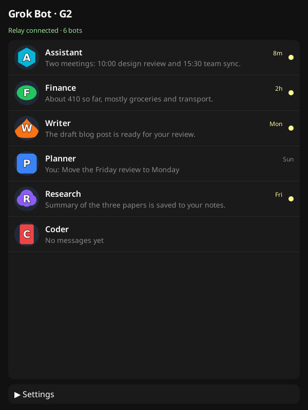 | 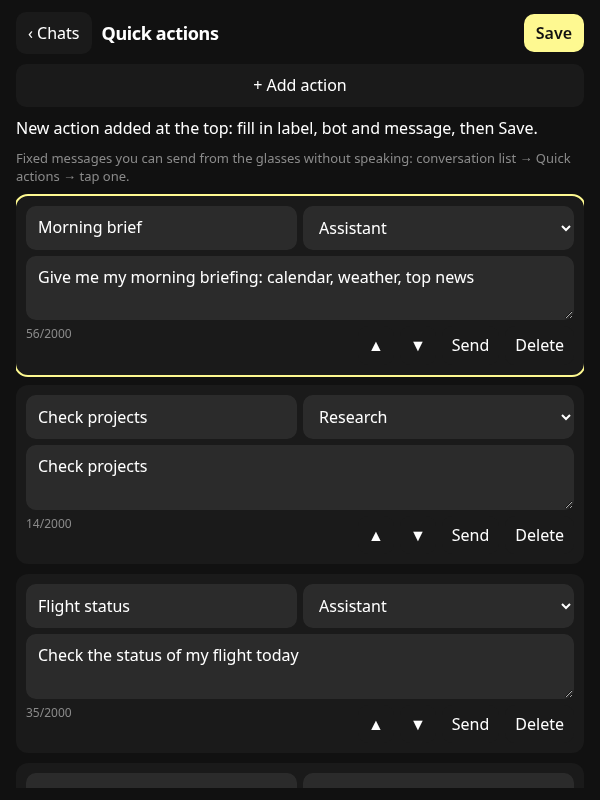 | 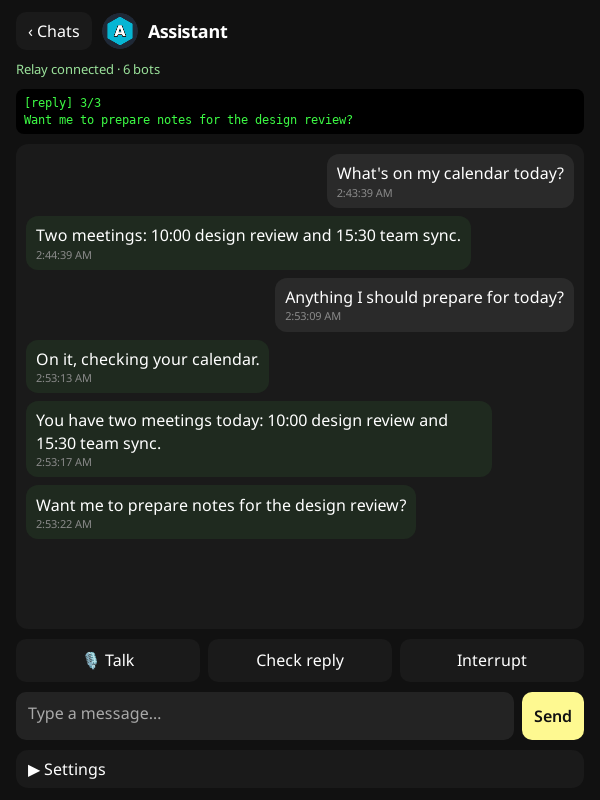 |

| Phone: voice settings (provider + write-only keys) | Phone: a rejected key is never saved | |
|---|---|---|
| 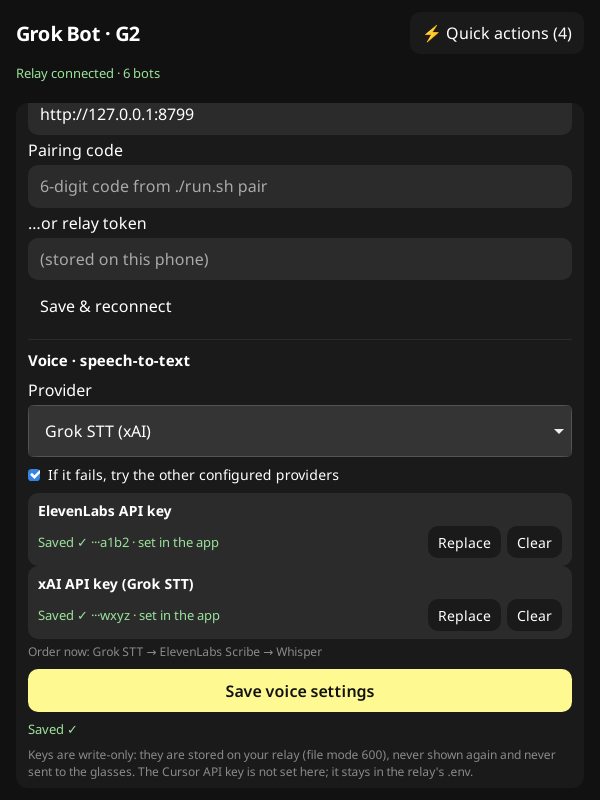 | 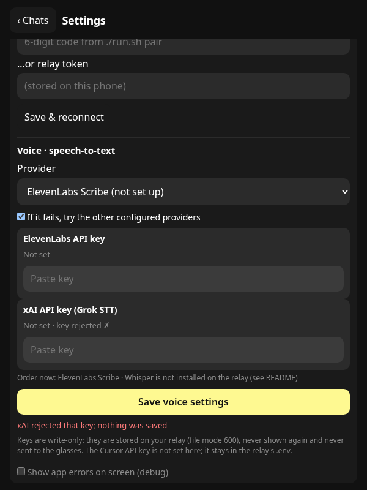 | |

| HUD: conversations (+ Quick actions) | HUD: quick actions | HUD: read view |
|---|---|---|
|  |  | 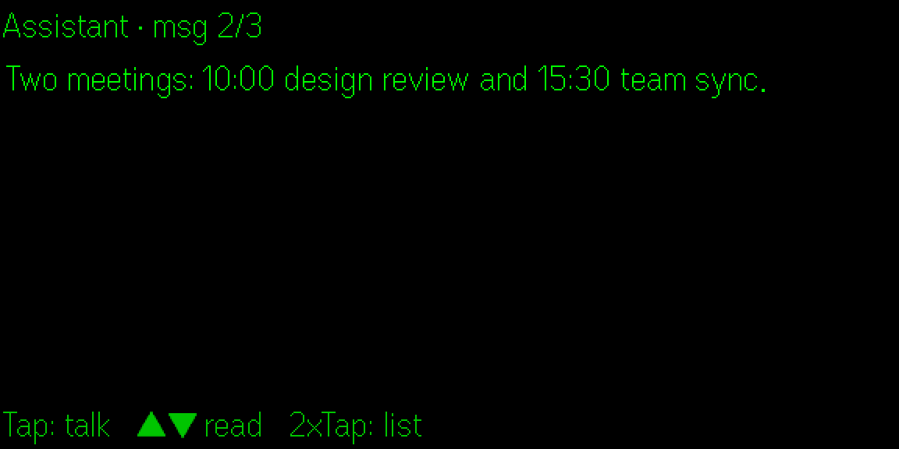 |

| HUD: long message, page 1/12 | HUD: long message, page 3/12 (URL + list) | HUD: long message, last page 12/12 |
|---|---|---|
| 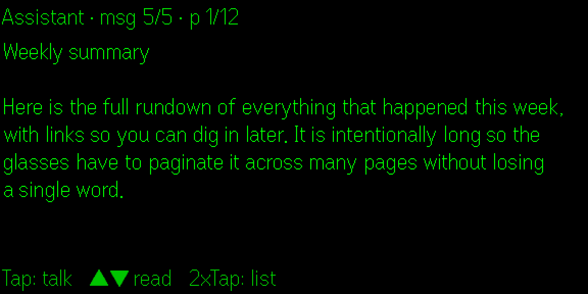 | 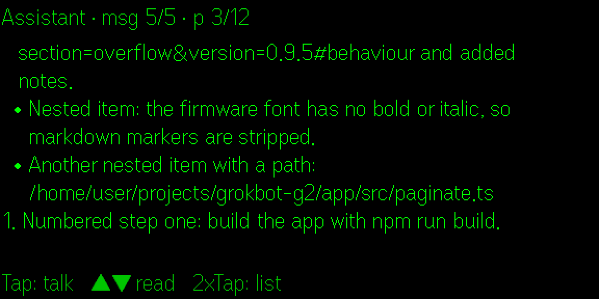 | 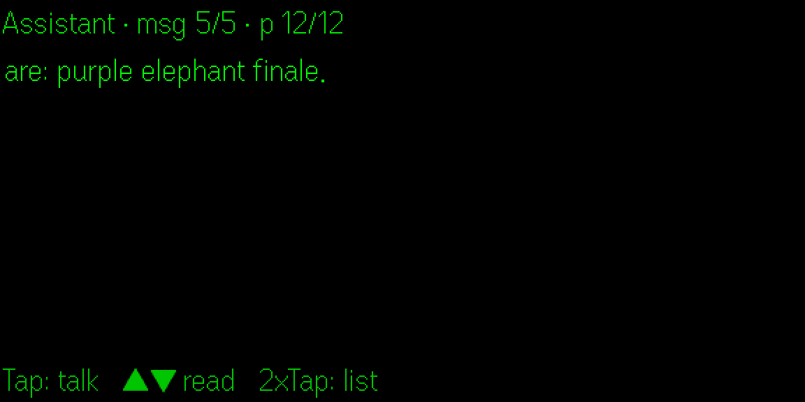 |

| HUD: streaming ("… more coming") | HUD: "↓ 1 new" while reading back | HUD: bot busy (409) |
|---|---|---|
| 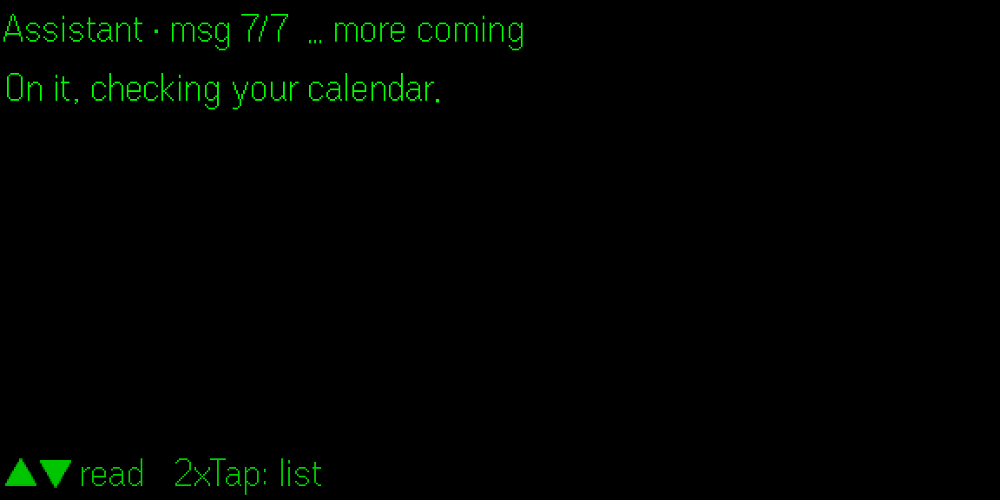 | 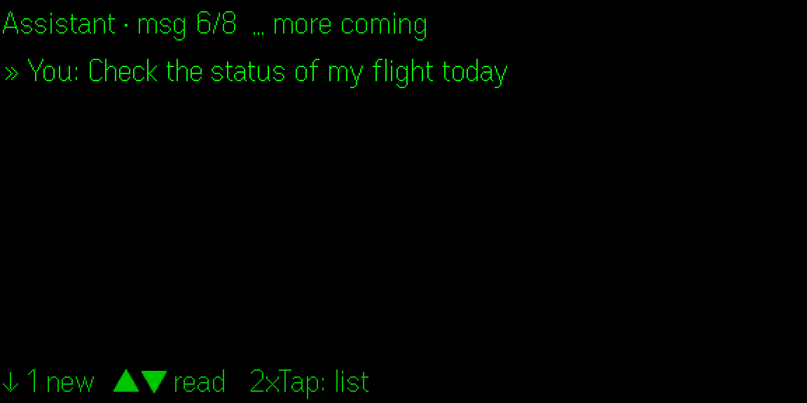 | 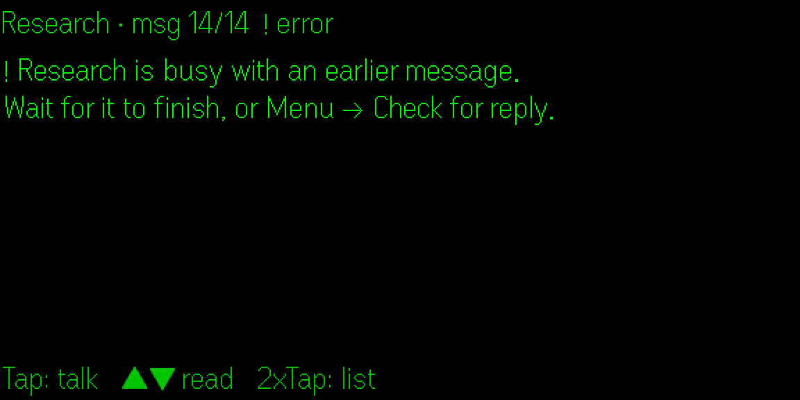 |

| HUD: banner for a new message (needs you) | HUD: banner for a card or file | Phone: live list, unread counts, `!` = needs you |
|---|---|---|
| 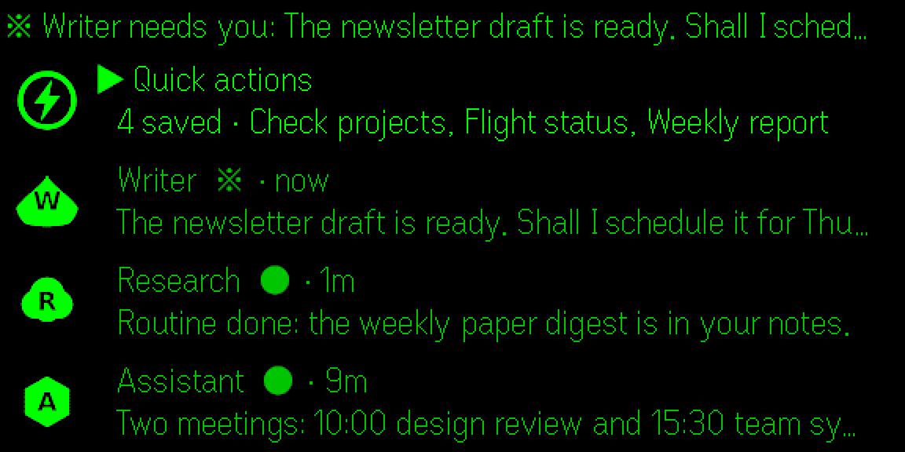 | 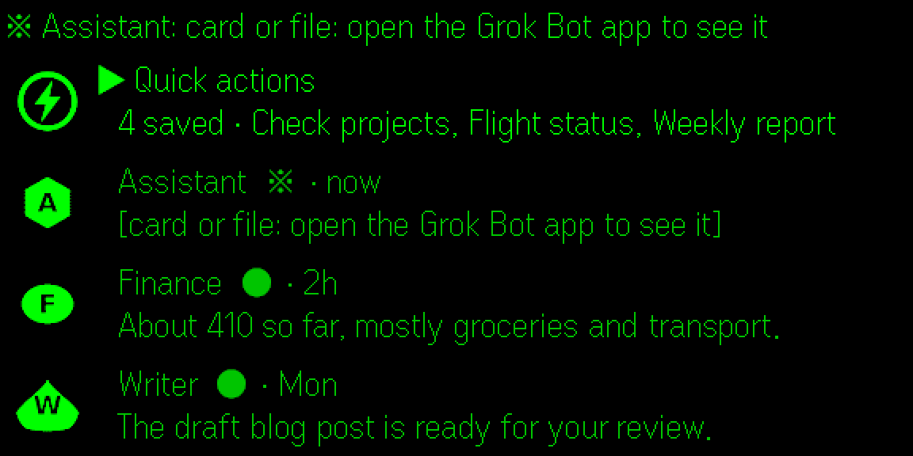 | 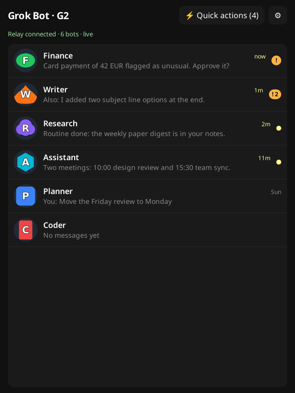 |

<sub>Screenshots come from the Even Hub simulator running the bundled mock bot (`./run.sh mock`). The bot names and avatars are generated examples.</sub>

## Features

- **Conversation list** on the HUD and the phone. Each row has an avatar, the bot name, a preview of the last
  message, a relative time and an unread dot. On the HUD you swipe to move and tap to open; 4 rows per screen.
  The first HUD row is **Quick actions**.
- **Avatars:** your own pictures (`avatars-src/<Bot>.png`) or a generated coloured shape with the bot's initial.
  The phone gets a 96 px colour version and the HUD a 40 px 4-bit greyscale dithered version.
- **Voice:** push-to-talk from the glasses mic (or the phone mic). The relay transcribes the 16 kHz PCM with
  **ElevenLabs Scribe**, **xAI Grok STT** or a local **Whisper** (faster-whisper or whisper.cpp), with an
  optional fallback to the other configured providers. Pick the provider and paste the ElevenLabs / xAI keys on
  the phone (**⚙ Settings → Voice**). Keys are write-only and stay on the relay.
- **Streaming per message:** a bot's ack, progress updates and final answer each arrive as soon as they are sent
  (SSE from `POST /chat/stream`). The HUD shows "… more coming" until the turn ends.
- **Read view + full pagination:** opening a conversation shows its history first, starting at the first unread
  message; nothing records until you tap. Every message is split into HUD pages by *measured glyph widths* (the
  firmware font was measured in the simulator, see `app/src/glyphs.ts`) with explicit line breaks, a safety margin
  and a 900-byte cap, so no page can overflow and the last page always ends with the message's last words.
  Markdown is turned into drawable plain text (bullets, links, tables, headings; emoji removed). The header shows
  `Bot · msg 2/3 · p 1/4`. Messages that arrive while you read an earlier page don't move you; the footer shows
  `↓ n new` instead.
- **Quick actions:** predefined messages (label, target bot, text) that you edit on the phone and fire from the
  glasses with one tap, no speaking. Stored on the relay (`data/actions.json`, `GET/PUT /actions`), cached on the
  phone. The reply streams into that bot's read view.
- **Background sync + live updates (v0.6):** the relay reads every bot's transcript in the background (read-only),
  so messages from the Grok Bot apps, routines and background work, and what you type in those apps, show up in
  the list and the read view within seconds while the app is open. Unread counts per bot, a `※` marker for
  messages that look like they need you, and a short **banner on the glasses** (`● Bot: first words…`) on any
  screen. See *Sync and live updates*.
- **Typed chat** with history on the phone screen, plus *Check reply*, *Interrupt* and *Re-ask* (glasses menu).
- **Security:** bearer-token auth on every API route, one-time 6-digit **pairing codes** so the token never sits in
  the app package, per-IP and global **rate limits**, and lockout after repeated bad tokens.

## How it works

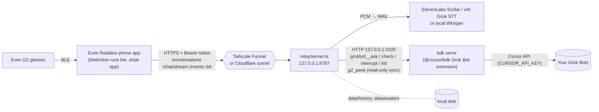

- **app/**: Vite + TypeScript Even Hub app built on `@evenrealities/even_hub_sdk`. It runs inside the Even
  Realities phone app and draws the HUD over BLE; the same page is the phone-screen UI.
- **relay/server.ts**: Node 22 HTTP server with no runtime dependencies. It handles auth, rate limits, STT,
  history, avatars and SSE streaming, and serves `app/dist` at `/app/` for QR sideloading.
- **relay/bdk/**: a minimal `@cursor/bdk` project that mounts the official Grok Bot agents extension. The
  relay calls its tools over `bdk serve`'s local HTTP API.

## Prerequisites

- **Even Realities G2** glasses and the **Even Realities** phone app (iOS/Android).
- An **Even Hub developer account**: sign in once at https://hub.evenrealities.com with the same account as
  the phone app. Developer Mode (QR sideload) shows up in the phone app after that.
- A **Cursor account with Grok Bots** and a **Cursor API key** for that account.
- An always-on computer for the relay (Linux or macOS) with **Node.js 22.13+**, `python3` with Pillow
  (`pip install pillow`) for avatars, `curl`.
- **Speech-to-text**, one or more of:
  - an **ElevenLabs API key** (Scribe),
  - an **xAI API key** (Grok STT, https://console.x.ai),
  - **local Whisper**: `./run.sh whisper` installs faster-whisper (prebuilt wheels, no compiler) and the `base`
    model (~600 MB disk, ~500 MB RAM while loaded). whisper.cpp also works.
- A **stable public HTTPS URL** for the relay, either:
  - **Tailscale Funnel** (free; you get `https://<machine>.<tailnet>.ts.net`), or
  - a **Cloudflare named tunnel** on a domain you control. Quick tunnels (`trycloudflare.com`) change URL every
    run, which breaks the packaged app's network whitelist.

## Setup

```bash
git clone <this repo> grokbot-g2 && cd grokbot-g2
cp .env.example .env && chmod 600 .env
./run.sh setup            # checks Node, npm ci in relay/bdk, relay, app; generates RELAY_TOKEN + BDK_TOKEN
```

1. **Bots:** edit `bots.json` (created from `bots.example.json`). Use each bot's **exact name** as shown in Grok
   Bot; the backend addresses bots by name and **creates a new empty bot for an unknown name**. Optional per bot:
   `avatarShape` (`blob|tablet|cloud|pebble|wedge|teardrop|hex|squircle`) and `avatarColor`
   (`red|orange|yellow|green|cyan|blue|violet|magenta|brown`). To use real pictures, drop `avatars-src/<Name>.png`.
   If your Grok Bots live in per-agent folders (`<agents>/<id>/profile.json` + `avatar.*`),
   `python3 tools/bots-from-agents.py <agents> --only "Exact Name" …` drafts `bots.json` with names copied
   verbatim; set `AGENTS_DIR=<agents>` so `tools/avatars.py` uses their pictures.
2. **`.env`:** set `CURSOR_API_KEY`, `RELAY_PUBLIC_URL` and `TUNNEL_MODE`. Optionally preset STT
   (`STT_PROVIDER`, `ELEVENLABS_API_KEY`, `XAI_API_KEY`); you can also do that later from the phone. Every option
   is documented in `.env.example`. **`CURSOR_API_KEY` is only ever set here**: the app has no field for it and
   no relay endpoint reads or writes it.
3. **Tunnel**
   - *Tailscale Funnel:* install Tailscale, run `tailscale up` (it prints a login link), and allow Funnel for the
     node in your tailnet policy. `RELAY_PUBLIC_URL=https://<machine>.<tailnet>.ts.net`. `./run.sh start` runs
     `tailscale funnel --bg $RELAY_PORT`. **No root / no apt?** Unpack the static binaries from
     https://pkgs.tailscale.com/stable/ into `./tailscale/`, set `TAILSCALED_BIN`, `TAILSCALE_BIN`,
     `TAILSCALE_STATE_DIR=$PWD/tailscale/state` and `TAILSCALED_FLAGS=--tun=userspace-networking`, then
     `./run.sh ts-login` starts a userspace tailscaled and prints the login link and, once logged in, your URL.
     GROK.md has the full walkthrough.
   - *Cloudflare:* create a named tunnel whose public hostname points to `http://127.0.0.1:8787`, then set
     `CLOUDFLARE_TUNNEL_TOKEN` (dashboard tunnel) or `CLOUDFLARE_TUNNEL=<name>` (locally managed).
     `./run.sh start` runs `cloudflared` and tracks its PID.
   - *none:* bring your own HTTPS reverse proxy to `127.0.0.1:$RELAY_PORT`.
4. **Try it offline first** (no real bot is contacted):
   ```bash
   ./run.sh mock                                              # mock bdk :3199 + relay :8799 with example chats
   tools/stream-test.sh "hello" Assistant http://127.0.0.1:8799
   ./run.sh mock stop
   ```
5. **Build the app and start the relay:**
   ```bash
   ./run.sh build     # avatars, writes RELAY_PUBLIC_URL into app.json whitelist + app, builds app/grokbot-g2.ehpk
   ./run.sh start     # tunnel + bdk + relay
   ./run.sh status    # local + public /health
   ```
   Set your own package id with `APP_PACKAGE_ID=com.yourname.grokbotg2` in `.env` before building.

## Installing on the glasses

**Private / beta build (recommended; keeps working while the phone is locked)**

1. Sign in at https://hub.evenrealities.com/login with the same account as the phone app, then force-quit and
   reopen the Even Realities app (that enables Developer Mode). Create a project for your package id
   (`APP_PACKAGE_ID`: globally unique, lowercase letters/digits and dots only, permanent once released).
2. *Private build (quick smoke test):* upload `app/grokbot-g2.ehpk` under **Private builds**. On the phone:
   Even Realities app → Even Hub → **Me → Apps → Private builds** → Install. Even's docs say private builds
   survive backgrounding only briefly.
3. *Beta build (recommended for daily use; survives a locked phone):* **Beta groups** → create e.g. `self-test`
   with your own email, **Builds** → upload the `.ehpk` → push it to the group. On the phone: **Me → Beta
   tester** → Install.
4. For every app change, bump `version` in `app/app.json`, run `./run.sh build`, then re-upload and reinstall.
   Relay-only changes just need `./run.sh restart-relay`.

The portal menu names above match what we saw while building this and may change; follow Even's current docs if
they differ.

**Dev sideload (fast iteration; stops when the phone locks):** Even app → Even Hub → developer section →
**Scan QR** → scan `qr/qr-app.png` (the relay serves the latest `app/dist` at `/app/`).

## Pairing

The relay token is never bundled into the app. To connect a phone:

```bash
./run.sh pair      # prints a 6-digit code, valid 10 minutes, single use
```

Until it is paired the app opens on its **Settings** screen (later: the **⚙** button on the conversation list).
Enter the code under **Pairing code**, then tap **Save & reconnect**. The app
exchanges the code for the token once (`POST /pair`) and stores it in the Even app's local storage. Repeated
wrong codes or tokens trigger rate limiting.

## Glasses gestures

| Screen | Swipe ▲ / ▼ | Tap | Double-tap | Hold |
|---|---|---|---|---|
| Conversation list | move selection | open (Quick actions or a bot's read view) | exit dialog | – |
| Read view | previous / next page, then previous / next message | start talking (tap again to send) | back to the list | push-to-talk (release sends) |
| While listening | – | send | cancel | – |
| Quick actions | move selection | send that message to its bot | back to the list | – |

The read view never starts the microphone on its own; the footer always shows the available actions
(`Tap: talk   ▲▼ read   2xTap: list`). The glasses menu (Even's context menu) adds *Bot list*, *Check for reply*,
*Interrupt bot*, *Re-ask last*, *Mic: glasses/phone* and *Quick actions*.

## Quick actions

On the phone: **⚡ Quick actions** → *+ Add action* (the new, empty action opens at the top of the list) → label (≤ 24 characters, shown on the HUD), bot, message
(≤ 2000 characters) → **Save**. ▲ ▼ reorder, *Delete* removes, *Send* fires it right away. Up to 50 actions.
On the glasses: conversation list → **Quick actions** (top row) → swipe to one (`Flight status > Assistant`) →
tap. The HUD switches to that bot's read view and streams the reply. If the bot is still busy with an earlier
message (409), the read view says so; nothing is sent.

The list lives in `data/actions.json` on the relay (git-ignored); on first run it is seeded from
`actions.example.json`, keeping only actions whose bot exists in `bots.json`. The relay validates every save
(array of ≤ 50, label ≤ 24, message ≤ 2000, known bot, 512 KB body cap).

## Sync and live updates

**What syncs.** `relay/sync.ts` polls each bot in `bots.json` through the bdk project's read-only tool
`relay/bdk/bot/tools/g2_peek.ts` and merges new transcript entries into `data/history/<bot>.json`:

- bot messages (`send-message`, also deliveries from routines and background work, which carry no special label),
  messages you typed in the Grok Bot apps (`message`/`user`), and images/files you sent there (`user-attachment`,
  shown as `[image or file sent from the Grok Bot app]`);
- **cards** (question widgets with options, approval cards, secret requests) and images/files a bot sent: the
  public entries API returns them as a `send-message` with **no text and no other fields**, so they appear as one
  read-only line, `[card or file: open the Grok Bot app to see it]`, flagged `※`. Answer, approve or enter
  secrets in the Grok Bot app; the relay never does (see *Known limitations*).

`g2_peek` reads `GET /v0/grokbot/sessions/{id}/entries?afterUpdatedSeq=` after a cursor the relay keeps
(`data/sync.json`). It never sends, never moves the `grokbot__check` read cursor, and never creates a bot: the
session id comes from the bots the relay already talked to, or (once, for names in `bots.json`) from the same
get-or-create lookup `grokbot__ask` uses, refusing a result that looks freshly created. It imports two
`@cursor/bdk` internals by path, so `@cursor/bdk` is pinned (`0.2.18`) in `relay/bdk/package.json`.

**Merge.** Dedupe by entry `seq`. Messages the relay recorded itself during a G2 turn adopt the matching seq
(same role and text within an hour, or the parts of a joined reply), so nothing appears twice. The first sync of
a bot is a silent backfill (up to 20 pages of 200 entries, no banner, no unread). `POST /chat` and
`/chat/stream` also store the bot's `earlierReplies` (messages it sent before your message) instead of
dropping them; the stream sends them as an `earlier` event.

**Poll rate.** Every `SYNC_ACTIVE_MS` (15 s) while a phone/glasses client is connected to `/events`, else every
`SYNC_IDLE_MS` (90 s). One request per bot per round (more only while paging); bots with nothing new for
`SYNC_QUIET_H` (24) hours are polled every 4th round; a bot the relay is streaming a turn for is skipped. The
interval stretches so the total stays under `SYNC_MAX_RPH` (3600 requests/hour). 429 and 5xx back off
exponentially (Retry-After honoured; the API sent no rate-limit headers when we checked). `SYNC=0` turns sync
off; `SYNC_RESOLVE=0` disables the name lookup. `GET /sync/status` shows requests in the last hour, errors,
backoff and per-bot state.

**Live updates.** `GET /events` is an SSE stream (bearer token): `hello`, `message {bot, origin, msg}`,
`unread {bot, unread, attn}`, `bot-status {bot, busy, working}` and `reset`, a `: ping` every 25 s, resume with
`Last-Event-ID`. The app reads it with `fetch` (so the token stays in a header), reconnects with backoff and
falls back to reloading `/conversations` every 60 s while the stream is down; the status line shows `· live`.
`POST /seen {bot}` stores the read position used for unread counts (sent when you read a conversation to the end).

**Glasses banner.** A new bot message that you are not already reading (and that did not come from your own G2
turn) shows for about 4 s in the HUD header on any screen: `● Research: Routine done: the weekly…`, or
`※ Writer needs you: …` when it needs attention. Tapping the conversation list while it shows opens that bot.
While you are recording or transcribing, the banner waits until you are done. `?banner=<ms>` in the app URL
changes the duration (testing).

**Needs attention (`※`)** is a heuristic: a card/file placeholder, or a bot message whose last line ends with a
question mark. Approval and secret-request types would be flagged too, but the API does not expose them today.

## Speech-to-text

| Provider | `stt.provider` | Key | Where audio goes | Measured on our relay* |
|---|---|---|---|---|
| ElevenLabs Scribe (`scribe_v2`) | `elevenlabs` (default) | `ELEVENLABS_API_KEY` or app | ElevenLabs | tested with scribe_v1: 0.5–1.1 s, 3/3 clips word-perfect |
| xAI Grok STT (`POST https://api.x.ai/v1/stt`) | `grok` | `XAI_API_KEY` or app | xAI | 0.2–0.5 s; 1/3 word-perfect ("G2" → "G two" twice, "glasses" → "classes", "of" → "on") |
| Local Whisper (faster-whisper `base`, CPU float32) | `whisper` | none | stays on the relay | 6–29 s on a busy 8-core box; 2/3 word-perfect ("three" → "free") |

<sub>*Three short English clips in the G2 format (16 kHz s16le mono: two recorded in the simulator, one
synthetic, `test/stt-sample.wav`), two runs each through the relay's `/stt`. A small sample; your voice, accent
and CPU will differ. Grok STT was the fastest and ElevenLabs the most accurate, so ElevenLabs stays the default.
Try them yourself with `tools/stt-test.sh <provider>`.</sub>

- **One setting picks the provider:** `STT_PROVIDER` in `.env`, overridden by the app (**⚙ Settings → Voice**).
  With **fallback** on (`STT_FALLBACK=1`, default; also a switch in the app) a failed request is retried with the
  other *configured* providers in the order elevenlabs → grok → whisper, and the phone shows which one answered.
- **Audio format:** the glasses send raw 16 kHz s16le mono PCM. The relay wraps it in a WAV header for every
  provider (ElevenLabs and xAI auto-detect WAV; Whisper reads it directly). WAV uploads pass through unchanged.
- **Grok STT** uses xAI's documented REST endpoint: multipart `file` (sent last, as the API requires),
  optional `language` + `format=true`, `Authorization: Bearer <XAI_API_KEY>`. `XAI_STT_URL` overrides the URL.
- **Whisper:** `./run.sh whisper` creates `./.whisper-venv` (with `uv` if present, else `python3 -m venv`),
  installs `faster-whisper` and downloads `WHISPER_MODEL_NAME` (default `base`) to `data/whisper-models`. The
  relay starts one long-lived worker (`tools/whisper-worker.py`) on first use, or at startup when Whisper is the
  chosen provider, and passes it no secrets. `WHISPER_COMPUTE=float32` is the default because `int8` returned
  empty text on our test CPU. For whisper.cpp set `WHISPER_BACKEND=cpp`, `WHISPER_BIN` and `WHISPER_MODEL`.

### In-app settings and how keys are protected

The phone's **⚙ Settings → Voice** section (shown once paired) has the provider picker, the fallback switch and
password fields for the **ElevenLabs** and **xAI** keys, nothing else.

- `GET /settings` (token required) returns the provider, fallback, order and, per key, only
  `{set, source: "app" | "env", last4}`. **Key values are never returned**, logged or sent to the glasses.
- `PUT /settings {provider?, fallback?, keys?: {elevenlabs?, xai?}, clear?: ["elevenlabs"|"xai"]}` is
  write-only: an empty or missing key means *unchanged*; **Clear** removes a key saved from the app (a key from
  `.env` stays until you edit `.env`). Unknown fields (a Cursor key, for example) are rejected.
- Before saving, the relay checks a new key with a cheap call (ElevenLabs `GET /v1/user`, xAI `GET /v1/models`).
  A rejected key is not saved and the phone shows *key rejected ✗*; if the check can't decide (network, scoped
  key) the key is saved and shown as *could not verify*. `STT_VALIDATE=0` turns the check off (offline/test).
- Keys must be 16–256 characters of `A–Z a–z 0–9 _ . -`; the body is capped at 16 KB; `PUT` is limited to
  10 per 10 minutes per IP. Every change writes an audit line such as `settings <ip> provider=grok xai=set(valid)`,
  and rejected attempts write `settings rejected <ip> <reason>`, never values.
- App-set keys are stored in `data/secrets.json` (`SECRETS_FILE`), written atomically with mode `600`, and take
  precedence over `.env`. They live only on the relay; the phone forgets the field as soon as it is saved.
- **The Cursor API key is relay-only.** It lives in `.env` (`CURSOR_API_KEY`, set when you install, see Setup)
  and is passed to `bdk serve`; it is not part of `/settings` or any other endpoint.

## Relay API (summary)

All routes need `Authorization: Bearer <RELAY_TOKEN>` except `GET /health`, `GET /app/*` and `POST /pair`.

| Route | Purpose |
|---|---|
| `GET /conversations` | Per bot: last message (with `attn`), time, count, `unread`, `attn`, avatar URLs (newest first) |
| `GET /events` | SSE live updates: `hello`, `message`, `unread`, `bot-status`, `reset`; heartbeat 25 s; `Last-Event-ID` resume |
| `POST /seen {bot, at?}` | Read position for unread counts → `{bot, unread}` |
| `GET /sync/status` | Background sync: interval, requests in the last hour, errors, backoff, per-bot state |
| `GET /bots`, `GET /history?bot=` | Bot list; per-bot history |
| `GET /actions` / `PUT /actions {actions:[{id?,label,bot,text}]}` | Quick actions (validated, stored in `data/actions.json`) |
| `POST /chat/stream {bot,text}` | SSE: `status`, `earlier {texts}` (messages the bot sent before yours), one `message {index,text,ms}` per bot message, `done`, `error` |
| `POST /chat {bot,text,wait?}` / `POST /check {bot,wait?}` | Non-streaming ask (returns `earlier` too) / poll for more (returns nothing while a stream for that bot is running). The app no longer polls `check` for messages a bot sent on its own: background sync does that |
| `POST /interrupt {bot}` | Interrupt the bot's current turn |
| `POST /stt[?provider=&lang=]` | Raw 16 kHz s16le mono PCM or WAV → `{text, provider, latencyMs, fallbackFrom?}` (`provider=` forces one provider, no fallback) |
| `GET /settings` / `PUT /settings` | STT provider, fallback and write-only ElevenLabs / xAI keys (see above); never returns key values |
| `GET /avatars/<name>.png`, `/avatars/<name>.hud.png` | Phone / HUD avatars |

## Operations

```bash
./run.sh status | start | stop | restart-relay | reload-relay | restart-bdk | pair | build | ts-login | whisper
tail -f logs/relay.log logs/bdk.log
```

`stop` only kills process groups that `run.sh` started (tracked in `run/*.pid`). It never touches Tailscale.

## Security notes

- The relay is reachable from the internet through your tunnel. Everything except `/health`, `/app/` and
  `/pair` needs the bearer token, compared in constant time. Limits per client IP: 120 requests/min overall,
  15 chats/min and 20 STT/min. 10 bad tokens or pairing codes in 10 minutes lock that IP out for the rest of the
  window, with a global cap as well. The client IP comes from the tunnel's header (last `X-Forwarded-For` hop for
  Funnel, `Cf-Connecting-Ip` for Cloudflare).
- The relay and `bdk serve` bind to `127.0.0.1` only. `bdk serve` takes its bearer token on the command line,
  so other local users can see it in `ps`. Run the relay on a machine you trust.
- Keep `.env`, `bots.json`, `data/` (history, avatars, pairing file, `secrets.json`) and `qr/` private. They are git-ignored.
- Anyone holding the relay token can talk to every bot listed in `bots.json`. To revoke access, rotate
  `RELAY_TOKEN` in `.env`, run `./run.sh restart-relay` and re-pair your phone.
- Audio goes to ElevenLabs or xAI only when that provider is chosen or used as a fallback; with Whisper it never
  leaves your machine. Turn fallback off if audio must never reach a provider you didn't pick.
- STT keys set from the app are write-only (see *In-app settings*); `data/secrets.json` is mode 600 and
  git-ignored. The Cursor API key can only be changed in `.env` on the relay.

## Known limitations

- **Font metrics come from the simulator:** glyph widths were measured in Even Hub simulator 0.9.5. Pages keep a
  24 px width margin and use 7 of the 8 lines that fit, in case the hardware font differs slightly.
- **No audio output:** the G2 has no speaker, so replies are text only.
- **Cards stay in the Grok Bot app:** question widgets, approvals, secret requests and bot images/files arrive
  from the public API as text-less entries (no prompt, options, file name or type), so the relay shows a
  placeholder and cannot render the options. Answering a widget in the app adds no user message to the
  transcript; it goes through a path the API does not expose, so the relay cannot answer it either. Approvals and
  secrets deliberately stay in the official app.
- **Live updates need the app open:** sync runs on the relay all the time, but the phone/glasses only get the
  banner while the Even app is running the G2 app (no push notifications).
- **Busy bots return 409:** if a bot is still working on an earlier message (from any client), nothing is sent.
  Use *Check reply* or wait.
- **Message-level streaming only:** the Grok Bot extension exposes whole messages, not word-by-word deltas.
  Each message appears within ~0.5–2 s of the bot sending it.
- **Exact bot names:** names in `bots.json` must match Grok Bot exactly, or a new empty bot is created.
- The HUD list composes rows from 4 image and 4 text containers (the SDK list widget only takes strings), so it
  shows 4 rows per screen.
- QR sideloaded apps stop when the phone locks; private/beta installs are needed for everyday use.

## Development and testing

- Mock stack: `./run.sh mock` (fake `grokbot__*` and `g2_peek` tools; every message gets a 3-message reply over
  12 s, a message containing "long" gets one ~3000-character reply). "Proactive" messages as if from a routine or
  the Grok Bot app: `curl -s -X POST localhost:3199/mock/proactive -d '{"agent":"Assistant"}'` (or `"text"`,
  `"kind":"card"|"user"|"attachment"|"card-answered"`), or `MOCK_PROACTIVE_MS=40000 ./run.sh mock`.
  `POST /mock/fail {"status":429,"n":2}` makes the next peeks fail.
- Sync test (mock only): `SYNC_ACTIVE_MS=3000 SYNC_IDLE_MS=10000 ./run.sh mock && node tools/sync-test.mjs`
  (SSE events, merge/dedupe, earlier replies, cards, resume, unread/seen, 429 backoff; expect `23/23 passed`).
- Pagination self-test: `cd app && npx esbuild test/paginate.test.ts --bundle --platform=node --format=esm
  --loader:.txt=text --outfile=/tmp/pt.mjs && node /tmp/pt.mjs` (every page fits, no text lost, last words on
  the last page).
- Simulator (Linux, headless): `tools/sim.sh start` → `tools/sim-pair.sh` → automation API on `:9898`
  (`/api/screenshot/glasses`, `/api/input`). Convert glasses screenshots with `tools/hudview.py`.
- Phone UI layout/keyboard test (mock stack running): `tools/phone-test.sh` builds `app/test/phone-harness.ts`
  (the phone screen without the Even bridge) and checks it in headless **WebKit** and Chromium at 390×844 and
  375×667, with the on-screen keyboard simulated by halving the viewport: the new quick action's editor, the
  voice key fields and the chat composer must stay visible, with no JS errors. Screenshots go to
  `test/sim/phone_*.png`. It refuses anything but the mock relay. Add `?debug` to the app URL (or tick
  *Show app errors on screen* in Settings) to get uncaught errors as a red banner on the phone.
- Typecheck: `(cd relay && npm run check)`, `(cd relay/bdk && npm run check)`, `(cd app && npm run build)`.

## For AI agents

See [GROK.md](GROK.md) for step-by-step instructions written for a Grok Bot (or any agent) setting this up for
its user.

## Credits and license

See [NOTICE.md](NOTICE.md). `@cursor/bdk` is proprietary and is installed from npm, not redistributed.
**No license has been chosen for this repository yet**, so all rights are reserved until one is added.
