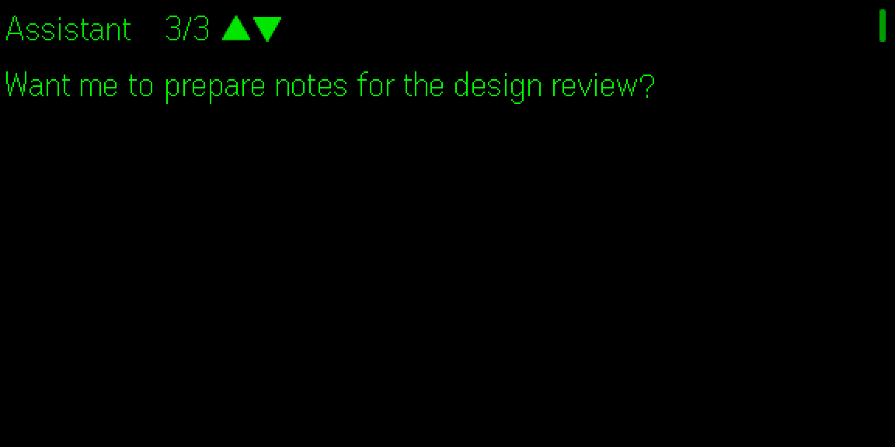
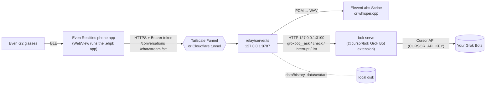

# Grok Bot G2

Talk to your **Grok Bots** from **Even Realities G2** smart glasses. You get a messaging-style conversation list on
the HUD and on the phone, push-to-talk voice, and replies that show up one message at a time.

You host it yourself. A small relay on your own computer connects the Even Hub glasses app to your Grok Bots
through Cursor's official `@cursor/bdk` Grok Bot extension, and an HTTPS tunnel (Tailscale Funnel or a Cloudflare
named tunnel) lets the phone reach that relay.

> Status: personal project / prototype. Not affiliated with Even Realities or Cursor.

| Phone: conversations | Phone: chat (streamed messages) |
|---|---|
|  |  |

| HUD: conversations | HUD: streaming ("… more coming") | HUD: reply page |
|---|---|---|
|  |  |  |

<sub>Screenshots come from the Even Hub simulator running the bundled mock bot (`./run.sh mock`). The bot names and avatars are generated examples.</sub>

## Features

- **Conversation list** on the HUD and the phone. Each row has an avatar, the bot name, a preview of the last
  message, a relative time and an unread dot. On the HUD you swipe to move and tap to open; 4 rows per screen.
- **Avatars:** your own pictures (`avatars-src/<Bot>.png`) or a generated coloured shape with the bot's initial.
  The phone gets a 96 px colour version and the HUD a 40 px 4-bit greyscale dithered version.
- **Voice:** push-to-talk from the glasses mic (or the phone mic). The relay transcribes the 16 kHz PCM with
  **ElevenLabs Scribe** or a local **whisper.cpp**.
- **Streaming per message:** a bot's ack, progress updates and final answer each arrive as soon as they are sent
  (SSE from `POST /chat/stream`). The HUD shows "… more coming" until the turn ends.
- **Paging:** long replies are split into ~400-character HUD pages (swipe up/down). Each new message starts on a
  new page.
- **Typed chat** with history on the phone screen, plus *Check reply*, *Interrupt* and *Re-ask* (glasses menu).
- **Security:** bearer-token auth on every API route, one-time 6-digit **pairing codes** so the token never sits in
  the app package, per-IP and global **rate limits**, and lockout after repeated bad tokens.

## How it works



- **app/**: Vite + TypeScript Even Hub app built on `@evenrealities/even_hub_sdk`. It runs inside the Even
  Realities phone app and draws the HUD over BLE; the same page is the phone-screen UI.
- **relay/server.ts**: Node 22 HTTP server with no runtime dependencies. It handles auth, rate limits, STT,
  history, avatars and SSE streaming, and serves `app/dist` at `/app/` for QR sideloading.
- **relay/bdk/**: a minimal `@cursor/bdk` project that mounts the official Grok Bot agents extension. The
  relay calls its tools over `bdk serve`'s local HTTP API.

## Prerequisites

- **Even Realities G2** glasses and the **Even Realities** phone app (iOS/Android).
- An **Even Hub developer account**: sign in once at https://hub.evenrealities.com with the same account as
  the phone app. Developer Mode (QR sideload) shows up in the phone app after that.
- A **Cursor account with Grok Bots** and a **Cursor API key** for that account.
- An always-on computer for the relay (Linux or macOS) with **Node.js 22.13+**, `python3` with Pillow
  (`pip install pillow`) for avatars, `curl`.
- **Speech-to-text**, either:
  - an **ElevenLabs API key** (Scribe), or
  - **whisper.cpp** built locally plus a ggml model (`ggml-base.bin` is a good start; ~150 MB RAM).
- A **stable public HTTPS URL** for the relay, either:
  - **Tailscale Funnel** (free; you get `https://<machine>.<tailnet>.ts.net`), or
  - a **Cloudflare named tunnel** on a domain you control. Quick tunnels (`trycloudflare.com`) change URL every
    run, which breaks the packaged app's network whitelist.

## Setup

```bash
git clone <this repo> grokbot-g2 && cd grokbot-g2
cp .env.example .env && chmod 600 .env
./run.sh setup            # checks Node, npm ci in relay/bdk, relay, app; generates RELAY_TOKEN + BDK_TOKEN
```

1. **Bots:** edit `bots.json` (created from `bots.example.json`). Use each bot's **exact name** as shown in Grok
   Bot; the backend addresses bots by name and **creates a new empty bot for an unknown name**. Optional per bot:
   `avatarShape` (`blob|tablet|cloud|pebble|wedge|teardrop|hex|squircle`) and `avatarColor`
   (`red|orange|yellow|green|cyan|blue|violet|magenta|brown`). To use real pictures, drop `avatars-src/<Name>.png`.
2. **`.env`:** set `CURSOR_API_KEY`, `RELAY_PUBLIC_URL`, `TUNNEL_MODE`, and the STT settings (`STT_PROVIDER`
   plus `ELEVENLABS_API_KEY`, or `WHISPER_BIN` + `WHISPER_MODEL`). Every option is documented in `.env.example`.
3. **Tunnel**
   - *Tailscale Funnel:* install Tailscale, run `tailscale up` (it prints a login link), and allow Funnel for the
     node in your tailnet policy. `RELAY_PUBLIC_URL=https://<machine>.<tailnet>.ts.net`. `./run.sh start` runs
     `tailscale funnel --bg $RELAY_PORT`. Containers without a system tailscaled can set `TAILSCALED_BIN` and
     `TAILSCALE_STATE_DIR` (and optionally `TAILSCALED_FLAGS=--tun=userspace-networking`).
   - *Cloudflare:* create a named tunnel whose public hostname points to `http://127.0.0.1:8787`, then set
     `CLOUDFLARE_TUNNEL_TOKEN` (dashboard tunnel) or `CLOUDFLARE_TUNNEL=<name>` (locally managed).
     `./run.sh start` runs `cloudflared` and tracks its PID.
   - *none:* bring your own HTTPS reverse proxy to `127.0.0.1:$RELAY_PORT`.
4. **Try it offline first** (no real bot is contacted):
   ```bash
   ./run.sh mock                                              # mock bdk :3199 + relay :8799 with example chats
   tools/stream-test.sh "hello" Assistant http://127.0.0.1:8799
   ./run.sh mock stop
   ```
5. **Build the app and start the relay:**
   ```bash
   ./run.sh build     # avatars, writes RELAY_PUBLIC_URL into app.json whitelist + app, builds app/grokbot-g2.ehpk
   ./run.sh start     # tunnel + bdk + relay
   ./run.sh status    # local + public /health
   ```
   Set your own package id with `APP_PACKAGE_ID=com.yourname.grokbotg2` in `.env` before building.

## Installing on the glasses

**Private / beta build (recommended; keeps working while the phone is locked)**

1. Sign in at https://hub.evenrealities.com and create an app for your package id if asked.
2. *Private build:* upload `app/grokbot-g2.ehpk` under **Private builds**. On the phone: Even Realities app →
   Even Hub → **Me → Apps → Private builds** → Install.
3. *Beta build (more robust when locked):* create a beta group (e.g. just your own email), upload the `.ehpk`
   under **Builds** and push it to the group. On the phone: **Me → Beta tester** → Install.
4. For every app change, bump `version` in `app/app.json`, run `./run.sh build`, then re-upload and reinstall.
   Relay-only changes just need `./run.sh restart-relay`.

The portal menu names above match what we saw while building this and may change; follow Even's current docs if
they differ.

**Dev sideload (fast iteration; stops when the phone locks):** Even app → Even Hub → developer section →
**Scan QR** → scan `qr/qr-app.png` (the relay serves the latest `app/dist` at `/app/`).

## Pairing

The relay token is never bundled into the app. To connect a phone:

```bash
./run.sh pair      # prints a 6-digit code, valid 10 minutes, single use
```

On the phone screen open **Settings → Pairing code**, enter the code, then tap **Save & reconnect**. The app
exchanges the code for the token once (`POST /pair`) and stores it in the Even app's local storage. Repeated
wrong codes or tokens trigger rate limiting.

## Relay API (summary)

All routes need `Authorization: Bearer <RELAY_TOKEN>` except `GET /health`, `GET /app/*` and `POST /pair`.

| Route | Purpose |
|---|---|
| `GET /conversations` | Per bot: last message, time, count, avatar URLs (newest first) |
| `GET /bots`, `GET /history?bot=` | Bot list; per-bot history |
| `POST /chat/stream {bot,text}` | SSE: `status`, one `message {index,text,ms}` per bot message, `done`, `error` |
| `POST /chat {bot,text,wait?}` / `POST /check {bot}` | Non-streaming ask / poll for more |
| `POST /interrupt {bot}` | Interrupt the bot's current turn |
| `POST /stt` | Raw 16 kHz s16le mono PCM or WAV → `{text}` |
| `GET /avatars/<name>.png`, `/avatars/<name>.hud.png` | Phone / HUD avatars |

## Operations

```bash
./run.sh status | start | stop | restart-relay | pair | build
tail -f logs/relay.log logs/bdk.log
```

`stop` only kills process groups that `run.sh` started (tracked in `run/*.pid`). It never touches Tailscale.

## Security notes

- The relay is reachable from the internet through your tunnel. Everything except `/health`, `/app/` and
  `/pair` needs the bearer token, compared in constant time. Limits per client IP: 120 requests/min overall,
  15 chats/min and 20 STT/min. 10 bad tokens or pairing codes in 10 minutes lock that IP out for the rest of the
  window, with a global cap as well. The client IP comes from the tunnel's header (last `X-Forwarded-For` hop for
  Funnel, `Cf-Connecting-Ip` for Cloudflare).
- The relay and `bdk serve` bind to `127.0.0.1` only. `bdk serve` takes its bearer token on the command line,
  so other local users can see it in `ps`. Run the relay on a machine you trust.
- Keep `.env`, `bots.json`, `data/` (history, avatars, pairing file) and `qr/` private. They are git-ignored.
- Anyone holding the relay token can talk to every bot listed in `bots.json`. To revoke access, rotate
  `RELAY_TOKEN` in `.env`, run `./run.sh restart-relay` and re-pair your phone.
- Audio goes to ElevenLabs only when `STT_PROVIDER=elevenlabs`; with whisper.cpp it never leaves your machine.

## Known limitations

- **No audio output:** the G2 has no speaker, so replies are text only.
- **History only covers this app:** previews and history come from the relay's own log, so messages you
  exchange with a bot in the Grok Bot desktop app don't appear (except replies that arrive during a G2 turn).
- **Busy bots return 409:** if a bot is still working on an earlier message (from any client), nothing is sent.
  Use *Check reply* or wait.
- **Message-level streaming only:** the Grok Bot extension exposes whole messages, not word-by-word deltas.
  Each message appears within ~0.5–2 s of the bot sending it.
- **Exact bot names:** names in `bots.json` must match Grok Bot exactly, or a new empty bot is created.
- The HUD list composes rows from 4 image and 4 text containers (the SDK list widget only takes strings), so it
  shows 4 rows per screen.
- QR sideloaded apps stop when the phone locks; private/beta installs are needed for everyday use.

## Development and testing

- Mock stack: `./run.sh mock` (fake `grokbot__*` tools; every message gets a 3-message reply over 12 s).
- Simulator (Linux, headless): `tools/sim.sh start` → `tools/sim-pair.sh` → automation API on `:9898`
  (`/api/screenshot/glasses`, `/api/input`). Convert glasses screenshots with `tools/hudview.py`.
- Typecheck: `(cd relay && npm run check)`, `(cd relay/bdk && npm run check)`, `(cd app && npm run build)`.

## For AI agents

See [GROK.md](GROK.md) for step-by-step instructions written for a Grok Bot (or any agent) setting this up for
its user.

## Credits and license

See [NOTICE.md](NOTICE.md). `@cursor/bdk` is proprietary and is installed from npm, not redistributed.
**No license has been chosen for this repository yet**, so all rights are reserved until one is added.
